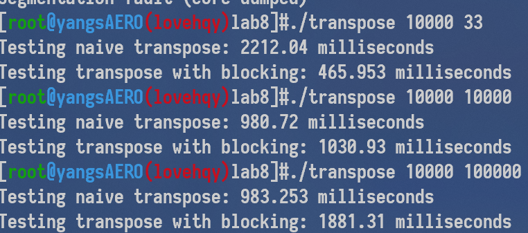

# s1
hit rate :`0`
step size 8=$2^3$, which is 32 bytes per access, how ever we only have 32 bytes cache, thus every time is a miss.

two sw determines the hit rate

## Q1

 block size & # of blocks & repcount & stepsize (in terms of fixed array size)

## Q2

 0.5, the same in each repcount loop 

## Q3

 increase the stepsize to 128 and increase the repcount as many as possible

# s2
hit rate 0.75
step size = 2

# test of transpose

